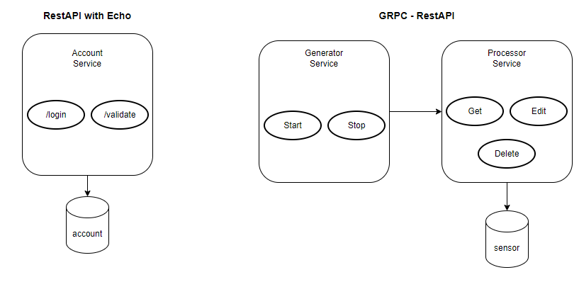
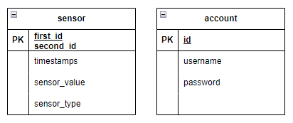

# Actuator Service

## Introduction
Actuator Service is a *microservice* to process sensors and human inputs.

## Overview
Actuator service workflows are described with below diagram:


With following Database relations described with below ERD:


## Useful Resources
Postman Collections: 
- Account Service: <a href="https://winter-moon-445005.postman.co/workspace/Interview~2d15e7b1-e602-4811-a3df-863ed320aadb/collection/6808273-66a25c74-c800-4784-864b-ce6678388862?action=share&creator=6808273">here</a>
- Generator and Processor Service: <a href="https://winter-moon-445005.postman.co/workspace/Interview~2d15e7b1-e602-4811-a3df-863ed320aadb/collection/642584f6e27fcc4e3e22b71e">here</a>
Swagger API:
- <host_to_service>/swagger-ui

## How to Use

### Running in Local

To run actuator service in local, first move to directory to desired service using sample command below:
```
$ cd service/<service_name>
$ go run main.go
```

### Authentication and Authorization Service

To start using Actuator Service, Authorization Token is required. To generate a new authorization token, use step defined below:
- Open Postman Collection for Account Service
- Go to sample Login request
- Login returns authorization token used in every GRPC calls in Actuator service.

#### Using Authorization Token

Token from Login must be inserted into GRPC Metadata with **Authorization** key.

### Generator GRPC

#### Generating Data Stream

To start generating random streams of data, use <Generator.Start> in the postman collection provided with below sample payload:
```
{
    "num_of_message_per_second": 1
}
```

#### Terminating Data Stream

To terminate random stream generator, use <Generator.Stop> in the postman collection provided.

### Processor GRPC

#### Fetching Data

To fetch data from generated data stream, use <Processor.Get> in the postman collection provided with below sample payload
```
{
    "sensor_filter": {
        "id1": {
            "data": "A"
        },
        "id2": {
            "data": 13
        },
        "start_timestamp": {
            "data": {
                "seconds": "1680181182"
            }
        },
        "end_timestamp": {
            "data": {
                "seconds": "1680423026"
            }
        }
    },
    "sensor_pagination": {
        "item_per_page": 1,
        "page_numbers": 1
    }
}
```

Notes:
- Sensor Filter defines filters options available to fetch specific data
  - To filter timestamp for each sensor due to inconvenience to insert specific timestamp, timestamp range is introduced.  
- Sensor Pagination defines pagination options available to fetch a specific amount of data

#### Deleting Data

- To Delete sensor data, use <Processor.Delete> using postman collection provided with sample payload:
```
{
    "end_timestamp": {
        "data": {
            "nanos": 1755864072
        }
    },
    "id1": {
        "data": "A"
    },
    "id2": {
        "data": 13
    },
    "start_timestamp": {
        "data": {
            "nanos": -2123416379
        }
    }
}
```

#### Editing Data

To edit sensor data, use <Processor.Edit> using postman collection provided with sample payload:
```
{
    "sensors": [
        {
            "id2": 13,
            "id1": "A",
            "timestamp": {
                "seconds": "659611"
            },
            "sensor_type": "Ultrasonic",
            "sensor_value": 69882119.48466146
        },
        {
            "id2": 15,
            "sensor_type": "Gyroscope",
            "sensor_value": 40499521.771295846,
            "timestamp": {
                "seconds": "51"
            },
            "id1": "Z"
        }
    ]
}
```